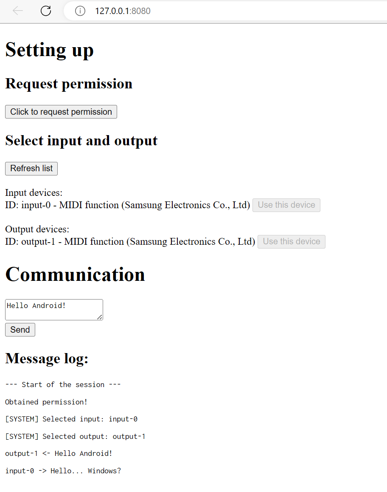
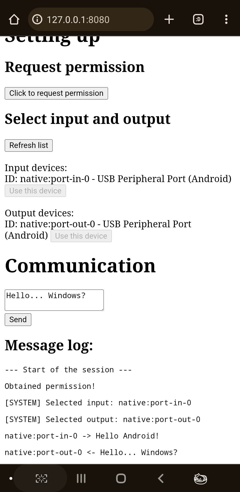

# Proof of concept: Stream binary data over MIDI
_This is so stupid..._

 

## Why?
To stream binary data like live camera feed to computer over USB, which I have to use MIDI protocol because the other approach requires USB debugging, which most average people finds it... confusing or scary because "ohhh developer options, I'm not gonna enable that".

## Try it out
### Try it now
idk I think it should be https://nahkd123.github.io/stream-over-midi or something.

### Host it yourself
- Clone this repo.
- Run `npm install`.
- Run `node build.mjs`.
- Open `http://127.0.0.1:8080` in browser.

## License
MIT.